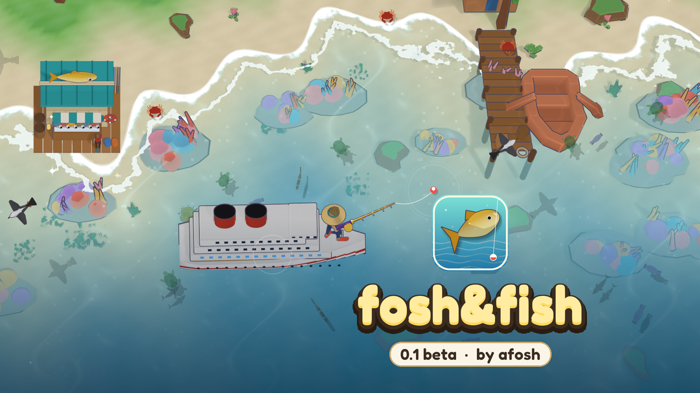

# 🐟 fosh&fish



A cozy top-down fishing game inspired by the **Virtual Fisher** Discord bot. Cast, catch, sell,
upgrade your rod and boat, travel through 7 biomes from the River to the Abyss, find pets and prestige.
Made with **Godot 4**; all the art is rendered in **Blender**.

**Made by afosh** · [LinkedIn](https://www.linkedin.com/in/mostafa-kmal-3731453a9/) · [GitHub](https://github.com/iiafosh)

## ▶️ Play (0.1 beta)

| Device | How |
|---|---|
| 🌐 **Browser / iPhone** | Play instantly at **https://iiafosh.github.io/fosh-and-fish/** (Safari: Share → Add to Home Screen) |
| 🖥️ **Windows** | [Releases](https://github.com/iiafosh/fosh-and-fish/releases/latest) → `fosh_fish-0.1-beta-windows.zip` → extract → `fosh_fish.exe` |
| 📱 **Android** | [Releases](https://github.com/iiafosh/fosh-and-fish/releases/latest) → `fosh_fish-0.1-beta-android.apk` → allow *Install unknown apps* |
| 🐧 **Linux** | [Releases](https://github.com/iiafosh/fosh-and-fish/releases/latest) → `fosh_fish-0.1-beta-linux.tar.gz` → `./fosh_fish.x86_64` |

No Godot or other install needed. How to play: [GUIDE.md](GUIDE.md) or press **G** in the game.
What's new: [CHANGELOG.md](CHANGELOG.md).
🎬 Watch the 30-second trailer: [fosh-and-fish-trailer-16x9.mp4](https://github.com/iiafosh/fosh-and-fish/releases/download/v0.1-beta/fosh-and-fish-trailer-16x9.mp4) (also [vertical](https://github.com/iiafosh/fosh-and-fish/releases/download/v0.1-beta/fosh-and-fish-trailer-9x16.mp4) and [square](https://github.com/iiafosh/fosh-and-fish/releases/download/v0.1-beta/fosh-and-fish-trailer-1x1.mp4))

## 💬 Feedback

In the game: **G → Feedback**, or [open an issue](https://github.com/iiafosh/fosh-and-fish/issues/new/choose).
Bugs, balance, ideas and art notes are all welcome.

## 🎣 What's in it

- **20 fish, 21 rods, 17 boats, 8 baits, 7 biomes**, with the bot's prices, levels, cooldowns and catch odds
- **Chests**, **Gold / Emerald / Lava / Diamond** fish, **8 charms**, **5 pets**
- Shop, special and league **upgrades**, **boosts & workers**, daily reward, daily and weekly quests
- **Prestige** with the Prestige Shop and the community P1–P160 buy-order guide
- A guided start: a pointer for the first steps, starter goals with rewards, and a fish collection
- Settings for music, sound and fullscreen; progress saves automatically

Mechanics follow the Virtual Fisher Encyclopaedia, the [miraheze wiki](https://virtualfisher.miraheze.org)
(snapshot in `wiki_dump/`) and the Prestige 0 Guide. Values the sources don't state are marked
`DERIVED` in `scripts/vf/vf_data.gd`.

## 🛠️ For developers

Open the folder in **Godot 4.7** (or run `launch_game.bat`).

```
scripts/vf/      vf_game.gd (simulation, autoload VF) · vf_main.gd (UI) · vf_stage.gd (scene) · vf_data.gd (data) · vf_guide.gd
scripts/         audio_manager.gd (music, sounds, settings)
scenes/          vf_main.tscn (main scene)
shaders/         water caustics
assets/vf/       sprites and scenes rendered by Blender
assets/brand/    icon, cover, splash
assets/third_party/   Kenney / Quaternius / OpenGameArt assets and the Fredoka font (see CREDITS.md)
data/vf/         XP-per-level table (25,000 levels)
tests/           headless mechanics and balance checks
tools/blender/   the Blender art pipeline
tools/           fetch_assets.py · serve_web.py · extract_doc.py · github/ · jev/ (design-decision helper)
wiki_dump/       source snapshot of the wiki and encyclopedia
```

**Tests and screenshots**
```bash
Godot_console.exe --headless --path . -s res://tests/vf_sim_test.gd
Godot_console.exe --path . -- --capture=OUT_DIR --demo=Ocean
```

**Trailer** (original music + beat-synced edit, 16:9 / 9:16 / 1:1; needs `pip install numpy pillow imageio-ffmpeg`)
```bash
Godot.exe --path . --write-movie WORK/reel.avi --fixed-fps 30 -- --reel > WORK/reel_log.txt
python tools/video/music.py WORK/music.wav
python tools/video/edit.py WORK OUT_DIR
```
Record at 1920x1080 (e.g. an `override.cfg` with `window/size/window_width_override=1920`). `-- --trailer` records the simpler captioned demo.

**Re-render the art** (Blender 4.2)
```bash
blender -b --factory-startup --python tools/blender/render_assets.py -- fish boats scenes
```

**Export** (presets in `export_presets.cfg`: Web, Windows Desktop, Linux, Android)
```bash
Godot_console.exe --headless --path . --export-release "Windows Desktop" build/windows/fosh_fish.exe
```

Saves live in `%APPDATA%/Godot/app_userdata/fosh&fish` on desktop and in browser storage on the web.

## 📜 Credits & license

Code: [MIT](LICENSE). Third-party art, sounds and fonts keep their own licenses, listed in [CREDITS.md](CREDITS.md).
fosh&fish is a fan project and is not affiliated with the Virtual Fisher bot.
